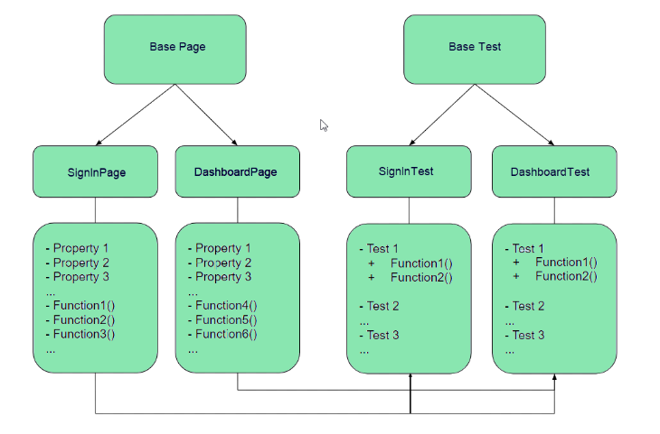

# challenge1-auto-playwright
1. How to setup and run the test scripts:
Setup & run instruction: 
  * Requirement: Node 18+
  - Cấu hình SSH-KEY (Tham khảo: https://viblo.asia/p/cau-hinh-ssh-key-cho-github-E375zXQdZGW)
  - Mở Gitbash run lệnh: git clone git@github.com:haudt12/challenge1-auto-playwright.git
  - Mở project/Terminal => install playwright: npm init playwright@latest
  - Cài các extensions để run testscript by Playwright: Playwight Test for VSCode, npm,...
  - Run script: npm run test to run testscripts
  - After test process finished, run script: npm run report to view report of testscripts via Allure on browser.

2. Explaination of your test design and any design patterns used.
  - Test design sử dụng theo cấu trúc POM: POM (Page Object Model) là một mẫu thiết kế mà mỗi trang của ứng dụng sẽ được đại diện bởi một lớp. Mỗi lớp sẽ chứa các định vị cho các phần tử của trang và các phương thức thực hiện hành động trên trang đó.
  => Cấu trúc này giúp tái sử dụng mã và dễ dàng bảo trì. Nếu một phần tử trên trang thay đổi, bạn chỉ cần cập nhật trong tệp POM của trang đó, thay vì phải cập nhật trong tất cả các test case có liên quan

  + folder "src/pages": Trang này chứa phần Locators và xử lý trong trang Template detail&Editor Template
  + folder "tests/modules":Trang này chạy test case xử lý các step trong testcase

   
3. What issues you encountered while doing the challenge and how you addressed them
  - Mất thời gian để tìm hiểu cách verify hiển thị chính xác Canvas
  => Solution: Tìm kiếm trên mạng và nhận được gợi ý từ anh Thanh Canh Nguyen Huu
  - Việc verify hiển thị danh sách các mẫu tương tự dưới  Mẫu template
  => Do không có thông tin của SRS cho case này nên đang verify theo Category

